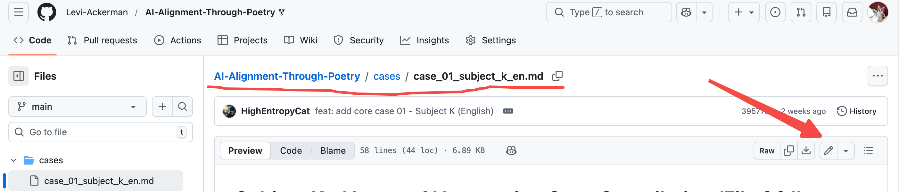
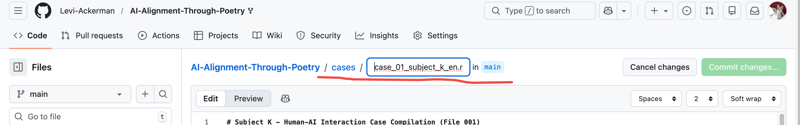

# Git_Hacker
| 让我们一起学Github
## 怎么在Github移动文件
case：我们希望将/AI-Alignment-Through-Poetry/cases
/case_01_subject_k_en.md 文件移到其父目录下，变为/AI-Alignment-Through-Poetry
/case_01_subject_k_en.md，可以按照如下步骤实现
1. 打开要移动的文件，点击编辑图标（铅笔图标）进入编辑状态

2. 看到文件名变成了可编辑状态，将文件名删光后，再按退格键（backspace）即可删除文件路径里的 cases/，然后重新输入一个文件名，点击commit即可

